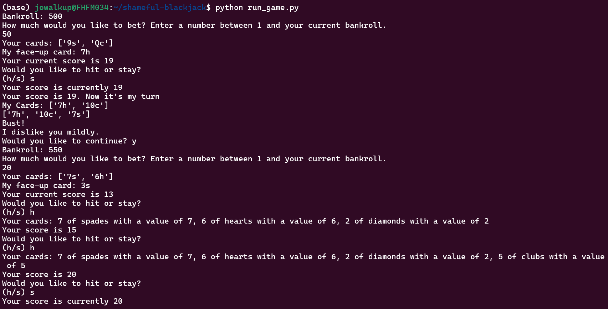

# Don't have cards? Still want to play blackjack?
Now you can play blackjack at home, right from your computer!* No stress, no risk, only fun :)  

## Key features:
- Customize your bet! There are no limits for a risk-taking individual like yourself.
- Never ending gameplay. If you run out of money, just add more (that's kind of embarrassing for you though).
- Includes typical blackjack gameplay, like splitting hands, doubling down, and changing your bet size.
- Will keep track of your bet through multiple games
- MIGHT manipulate your gameplay with some targeted commentary

Simple interface with keyboard based input.
  
## [INSERT VIDEO HERE]

Ready to play? Check out the setup instructions [here](/README.md):

About the creators:  
Jo: likes blackjack, keeps mysteriously losing money  
Ivry: calls himself the Big Cheese, but is lactose intolerant  
Althea: likes cheesecake and didn't realize how much until the cravings started
